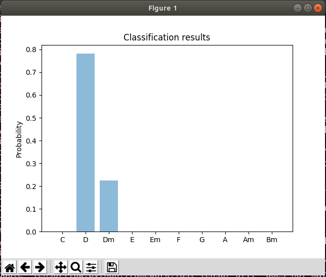

Chord Recognition in Python

NOTE this was tested using the following setup:

```
os: Ubuntu 18.04

python --version
Python 3.6.9
```

This program is a university project on the introductory course to artificial intelligence.

You'll need python 3, pip, and virtualenv(optional but recomended) to run the program

1. Clone the repository
2. Go inside the project folder `cd Chords.py/final_project`
3. Create a virtualenv ```virtualenv -p python3 my_env```
4. Activate your environment ```source my_env/bin/activate``` (linux) ```my_env/Scripts/activate.bat``` (windows)
5. Install the dependencies ```pip install -r requirements.txt```   

At this point you have the environment ready to use several entry points.

* `python predict.py` or `python predict.py path/to/song.wav` will give you a prediction of the chord present in that sound file, by default it goes to `songs/d.wav` which is the D chord. It will show a window similar to this one.



* `python split.py songs/guitar/about_a_girl.wav` is an example of the `split.py` entry point that takes a longer song, **splits** it and runs the prediction for each song piece. The results are saved in a filed called `spliter_result.txt`
  
  * Example, if you ran `python split.py songs/guitar/about_a_girl.wav`, then `spliter_result.txt` would have the following content: `em g em g em em em g em em g g em g g g em g g g em em g em em g g em em g g` which are the chords that it was able to identify on the song.

* In the file `paper.pdf` you'll find the final report of this university project with some references added. Currently it is only available in Spanish, you could go and try to use a translator, hope it helps

